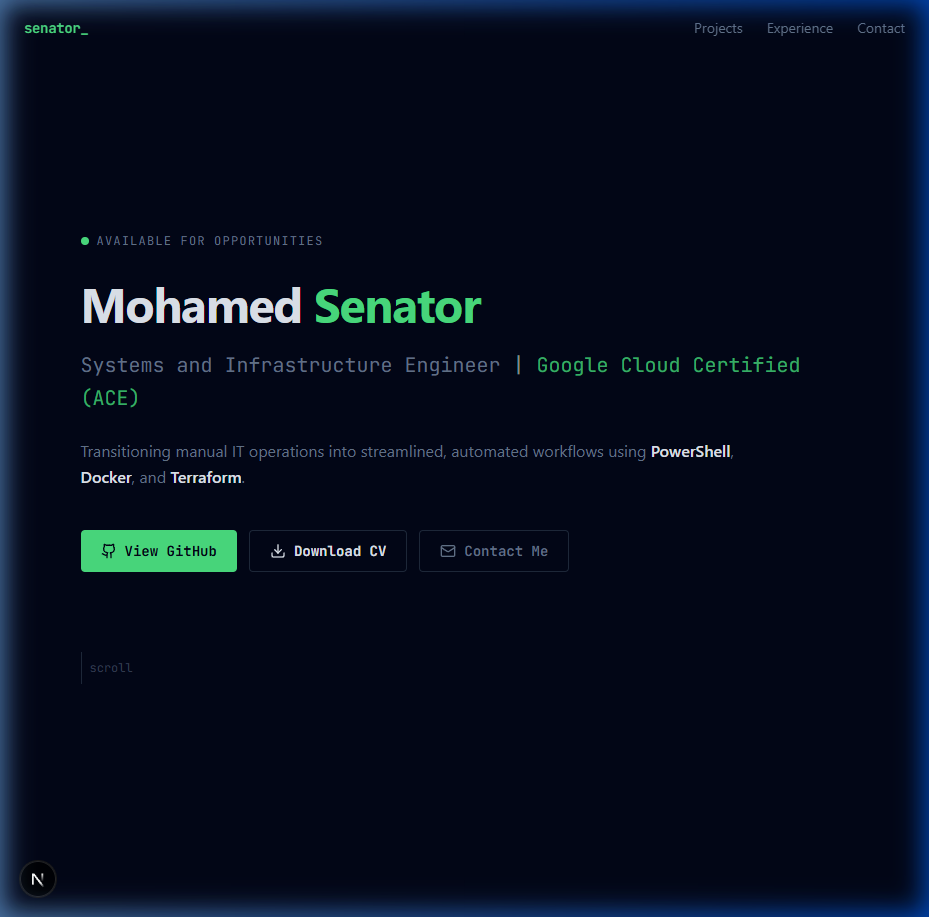
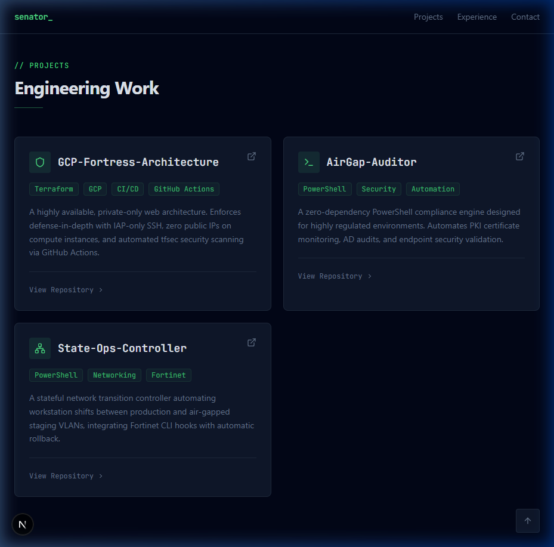
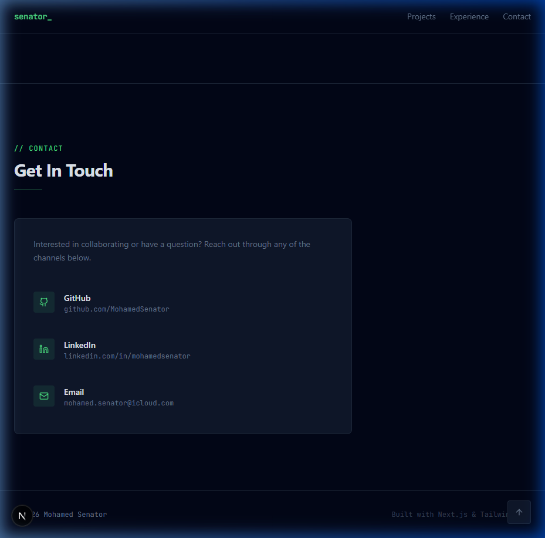

# Mohamed Senator — Portfolio

A professional, dark-themed developer portfolio built with **Next.js 16 (App Router)**, **Tailwind CSS v4**, and **Lucide React**.

> **Design Language**: "Command Center / Engineer Docs" — strict dark mode, high contrast, monospaced fonts for technical details, zero unnecessary animations.

## Tech Stack

| Technology | Purpose |
|---|---|
| Next.js 16 (App Router) | Framework & SSG |
| Tailwind CSS v4 | Styling with custom dark theme tokens |
| Lucide React | Minimalist iconography |
| JetBrains Mono | Monospace font for technical elements |
| Inter | Body text |

## Featured Architecture

This portfolio is purpose-built to showcase enterprise-grade infrastructure and automation projects:
* **GCP-Fortress-Architecture:** Highly available, private-only Google Cloud web architecture deployed via Terraform with CI/CD.
* **GCP-Kube-Vanguard:** Secure Google Kubernetes Engine (GKE) deployment featuring private cluster topology and automated provisioning.
* **AirGap-Auditor:** Zero-dependency PowerShell compliance engine for PKI and AD environments.
* **State-Ops-Controller:** Stateful PowerShell network transition controller for isolated VLANs.

## Screenshots

### Hero



### Projects



### Experience


### Contact



## Getting Started

```bash
# Install dependencies
npm install

# Run development server
npm run dev

# Production build
npm run build
```

## Deploy to Vercel

Push this repo to GitHub and connect it at [vercel.com](https://vercel.com), or run:

```bash
npx vercel
```

## Project Structure

```
src/app/
├── globals.css    # Dark theme tokens, scrollbar, smooth scroll
├── layout.tsx     # Fonts (Inter + JetBrains Mono), SEO metadata
└── page.tsx       # All sections: Navbar, Hero, Projects, Experience, Contact, Footer
public/
└── Mohamed_Senator_CV.pdf
```

## License

© 2026 Mohamed Senator